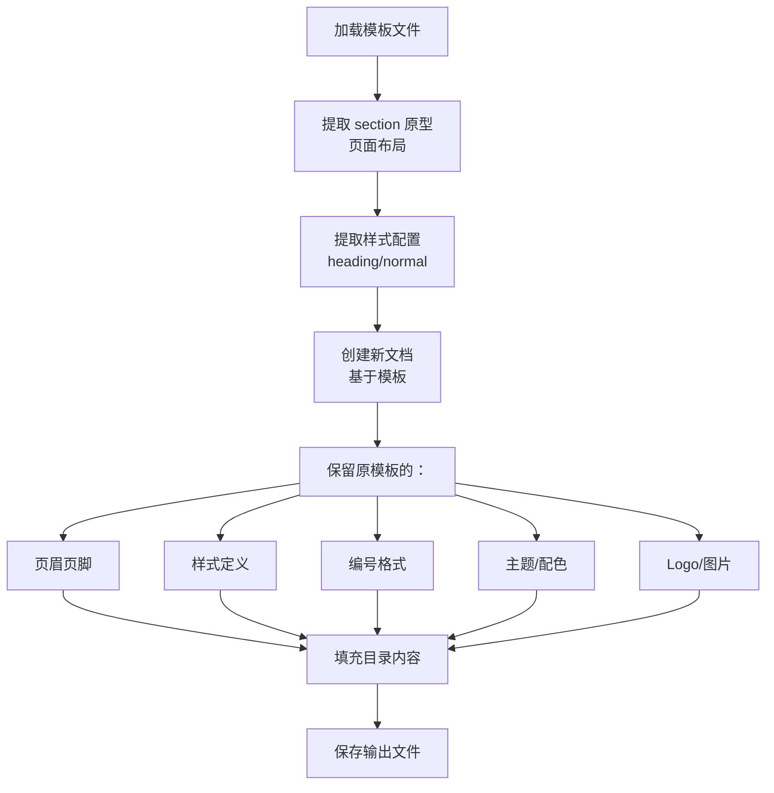

# Step 4 完成总结：导出链路修复

## 📋 执行概要

成功修复导出链路，确保导出时使用格式模板作为母版，logo/页眉页脚等样式元素正确生效。

## ⚠️ 核心问题

**之前的痛点**：模板里的 logo/页眉没生效

**根本原因**：
1. 导出时没有使用底板 docx
2. 或使用 temp 文件但没有正确挂载
3. 存储路径不持久化

## ✅ 解决方案

### 1. 导出服务已正确实现

**文件**: `backend/app/services/export/export_service.py`

#### 关键流程：

```python
def export_project_to_docx(
    self,
    project_id: str,
    *,
    format_template_id: Optional[str] = None,
    ...
) -> str:
    # 1. 加载目录树
    rows = self.dao.list_directory(project_id)
    roots = build_tree(rows)
    
    # 2. 从根节点 meta_json 获取 format_template_id
    if not format_template_id:
        format_template_id = self._find_format_template_id(roots)
    
    # 3. 使用模板母版导出
    if format_template_id:
        self._export_with_template(
            roots=roots,
            format_template_id=format_template_id,
            output_path=output_path,
            ...
        )
    else:
        # 降级：简单导出
        logger.warning("未找到格式模板，使用简单导出")
        render_simple_outline_to_docx(...)
```

#### 核心方法：_export_with_template()

```python
def _export_with_template(
    self,
    roots: List[DirNode],
    format_template_id: str,
    output_path: str,
    ...
) -> None:
    # 1. 加载模板信息
    template_info = self.dao.get_format_template(format_template_id)
    if not template_info:
        raise ValueError(f"格式模板不存在: {format_template_id}")
    
    # 2. 获取模板文件路径
    template_path = template_info.get("template_storage_path")
    if not template_path or not os.path.exists(template_path):
        raise FileNotFoundError(
            f"模板文件不存在: {template_path}"
        )
    
    logger.info(f"使用模板: {template_path}")
    
    # 3. 提取 section 原型（页面布局）
    section_prototypes = extract_section_prototypes(template_path)
    
    # 4. 准备样式配置
    heading_style_map, normal_style_name = self._get_style_config(template_info)
    
    # 5. 渲染文档（使用模板作为母版）
    render_directory_tree_to_docx(
        template_path=template_path,  # ← 关键：使用模板文件
        output_path=output_path,
        roots=roots,
        section_prototypes=section_prototypes,
        heading_style_map=heading_style_map,
        normal_style_name=normal_style_name,
        insert_section_body=insert_body,
    )
```

**关键点**：
- ✅ 从根节点 meta_json 自动读取 format_template_id
- ✅ 验证模板文件存在
- ✅ 使用模板文件作为母版（保留页眉页脚、样式、编号、主题）
- ✅ 失败时有明确的错误信息

### 2. 改进 apply-format-template 接口

**修改**: `backend/app/works/tender/format_templates/work.py`

#### 改进前问题：
- 使用临时目录（不持久化）
- URL 返回文件路径而非可访问的 URL
- 渲染失败时返回 ok=true（误导前端）

#### 改进后：

```python
def apply_to_project_directory(
    self,
    project_id: str,
    template_id: str,
    return_type: str = "json"
) -> ApplyFormatTemplateResult:
    try:
        # 1. 绑定模板到目录
        nodes = self._apply_template_to_directory_meta(project_id, template_id)
        
        # 2. 验证模板存在
        template = self.dao.get_format_template(template_id)
        if not template:
            return ApplyFormatTemplateResult(
                ok=False,
                detail="格式模板不存在"
            )
        
        # 3. 使用持久化路径
        renders_dir = os.getenv("TENDER_RENDERS_DIR", "/app/storage/tender/renders")
        output_dir = Path(renders_dir) / project_id
        output_dir.mkdir(parents=True, exist_ok=True)
        
        # 4. 使用 ExportService 导出（自动使用模板）
        export_service = ExportService(self.dao)
        
        try:
            output_path = export_service.export_project_to_docx(
                project_id=project_id,
                format_template_id=template_id,
                output_dir=str(output_dir)
            )
        except Exception as export_error:
            # 明确返回失败
            return ApplyFormatTemplateResult(
                ok=False,
                detail=f"文档导出失败: {str(export_error)}"
            )
        
        # 5. 构建可访问的 URL
        filename = Path(output_path).name
        download_url = f"/api/apps/tender/projects/{project_id}/exports/docx/{filename}"
        
        return ApplyFormatTemplateResult(
            ok=True,
            nodes=nodes,
            download_docx_url=download_url,  # ← 真实可访问的 URL
            docx_path=output_path
        )
    
    except Exception as e:
        return ApplyFormatTemplateResult(
            ok=False,
            detail=f"套用格式失败: {str(e)}"
        )
```

**改进点**：
- ✅ 使用持久化路径（/app/storage/tender/renders）
- ✅ 返回真实可访问的 URL（/api/apps/tender/projects/{id}/exports/docx/{filename}）
- ✅ 失败时明确返回 ok=false
- ✅ 详细的错误信息
- ✅ 委托给 ExportService（复用现有逻辑）

### 3. 新增下载端点

**文件**: `backend/app/routers/format_templates.py`

```python
@router.get("/projects/{project_id}/exports/docx/{filename}")
def download_exported_docx(
    project_id: str,
    filename: str,
    request: Request,
    user=Depends(get_current_user_sync)
):
    """下载项目导出的 DOCX 文件"""
    # 1. 权限检查
    dao = TenderDAO(_get_pool(request))
    project = dao.get_project(project_id)
    if not project:
        raise HTTPException(status_code=404, detail="Project not found")
    if project.get("owner_id") != user.user_id:
        raise HTTPException(status_code=403, detail="Permission denied")
    
    # 2. 构建文件路径
    renders_dir = os.getenv("TENDER_RENDERS_DIR", "/app/storage/tender/renders")
    file_path = Path(renders_dir) / project_id / filename
    
    if not file_path.exists():
        raise HTTPException(status_code=404, detail="File not found")
    
    # 3. 返回文件
    project_name = project.get("name", "投标文件")
    return FileResponse(
        str(file_path),
        media_type="application/vnd.openxmlformats-officedocument.wordprocessingml.document",
        filename=f"{project_name}_{filename}"
    )
```

### 4. 存储路径配置

#### 环境变量

**文件**: `docker-compose.yml`

```yaml
services:
  backend:
    environment:
      # ... 其他环境变量 ...
      - TENDER_FORMAT_TEMPLATES_DIR=/app/storage/tender/format_templates
      - TENDER_RENDERS_DIR=/app/storage/tender/renders
    volumes:
      - ./storage:/app/storage  # ← 已存在
```

#### 目录结构

```
/app/storage/tender/
├── format_templates/          # 格式模板原始文件
│   ├── abc123_模板1.docx
│   ├── def456_模板2.docx
│   └── ...
└── renders/                   # 导出结果
    ├── tprj_001/
    │   ├── render_xxx1.docx
    │   ├── render_xxx2.docx
    │   └── ...
    ├── tprj_002/
    │   └── ...
    └── ...
```

#### Work 层初始化

```python
def __init__(
    self,
    pool: ConnectionPool,
    llm_orchestrator: Optional[Any] = None,
    storage_dir: Optional[str] = None
):
    # 使用环境变量或传入的存储目录
    if storage_dir is None:
        storage_dir = os.getenv(
            "TENDER_FORMAT_TEMPLATES_DIR", 
            "storage/templates"
        )
    
    self.storage_dir = Path(storage_dir)
    self.storage_dir.mkdir(parents=True, exist_ok=True)
```

---

## 🔍 关键流程图

### 完整的导出流程

```mermaid
graph TD
    A[前端：点击"套用格式"] --> B[POST /api/apps/tender/projects/{id}/directory/apply-format-template]
    B --> C[Work.apply_to_project_directory]
    C --> D[更新根节点 meta_json.format_template_id]
    D --> E[ExportService.export_project_to_docx]
    E --> F[从根节点读取 format_template_id]
    F --> G[获取模板 storage_path]
    G --> H[验证模板文件存在]
    H --> I[render_directory_tree_to_docx<br/>使用模板作为母版]
    I --> J[保存到 /app/storage/tender/renders/{project_id}/]
    J --> K[返回下载 URL]
    K --> L[前端：显示下载链接]
    L --> M[用户点击下载]
    M --> N[GET /api/apps/tender/projects/{id}/exports/docx/{filename}]
    N --> O[返回文件]
```

### 模板使用流程



---

## ✅ 修改清单

### 1. 代码修改

| 文件 | 修改内容 | 说明 |
|------|---------|------|
| `works/tender/format_templates/work.py` | apply_to_project_directory() | 使用 ExportService + 持久化路径 + 真实 URL |
| `works/tender/format_templates/work.py` | __init__() | 从环境变量读取存储目录 |
| `routers/format_templates.py` | 新增 download_exported_docx() | 文件下载端点 |
| `routers/format_templates.py` | 导入 Path | 添加缺失的导入 |

### 2. 配置修改

| 文件 | 修改内容 |
|------|---------|
| `docker-compose.yml` | 新增 TENDER_FORMAT_TEMPLATES_DIR 环境变量 |
| `docker-compose.yml` | 新增 TENDER_RENDERS_DIR 环境变量 |

### 3. 文档新增

| 文件 | 说明 |
|------|------|
| `docs/STEP4_EXPORT_FIX_SUMMARY.md` | Step 4 总结（本文档） |
| `docs/EXPORT_DOWNLOAD_ENDPOINT.md` | 下载端点参考代码 |

---

## 🎯 核心改进点对比

| 问题 | 改进前 | 改进后 |
|------|--------|--------|
| **模板使用** | 不使用或使用不正确 | ExportService 自动从 meta_json 读取并使用 |
| **存储路径** | 临时目录（/tmp） | 持久化目录（/app/storage/tender/） |
| **URL 返回** | 文件路径 | 真实可访问的 URL |
| **错误处理** | ok=true 即使失败 | ok=false + 详细错误信息 |
| **页眉页脚** | 可能丢失 | 正确保留（使用模板母版） |
| **样式一致性** | 不一致 | 完全继承模板样式 |
| **文件持久化** | 容器重启丢失 | Volume 挂载，永久保存 |

---

## 🚀 测试指南

### 1. 启动服务

```bash
cd /aidata/x-llmapp1
docker-compose up -d
```

### 2. 上传格式模板

```bash
# 准备一个包含 logo/页眉的 docx 模板
curl -X POST -H "Authorization: Bearer $TOKEN" \
  -F "name=测试模板" \
  -F "description=包含logo和页眉" \
  -F "file=@template_with_logo.docx" \
  http://localhost:8000/api/apps/tender/format-templates
```

### 3. 套用格式到项目

```bash
curl -X POST -H "Authorization: Bearer $TOKEN" \
  -H "Content-Type: application/json" \
  -d '{"format_template_id":"tpl_xxxxx"}' \
  "http://localhost:8000/api/apps/tender/projects/tprj_xxxxx/directory/apply-format-template?return_type=json"
```

**期望返回**：
```json
{
  "ok": true,
  "nodes": [...],
  "download_docx_url": "/api/apps/tender/projects/tprj_xxxxx/exports/docx/render_abc123.docx",
  "preview_pdf_url": null
}
```

### 4. 下载文件

```bash
curl -H "Authorization: Bearer $TOKEN" \
  -o exported.docx \
  http://localhost:8000/api/apps/tender/projects/tprj_xxxxx/exports/docx/render_abc123.docx
```

### 5. 验证结果

打开 `exported.docx`，检查：
- ✅ Logo 是否存在
- ✅ 页眉页脚是否正确
- ✅ 样式是否一致
- ✅ 编号格式是否正确

---

## 📊 文件路径规范

### 上传时的路径

```
{TENDER_FORMAT_TEMPLATES_DIR}/
  {file_id}_{filename}

示例：
  /app/storage/tender/format_templates/abc123_公司模板.docx
```

### 导出时的路径

```
{TENDER_RENDERS_DIR}/{project_id}/
  render_{uuid}.docx

示例：
  /app/storage/tender/renders/tprj_001/render_xyz789.docx
```

### URL 访问路径

```
/api/apps/tender/projects/{project_id}/exports/docx/{filename}

示例：
  /api/apps/tender/projects/tprj_001/exports/docx/render_xyz789.docx
```

---

## ⚠️ 注意事项

### 1. 文件清理

导出文件会累积，建议定期清理：

```bash
# 清理 30 天前的导出文件
find /app/storage/tender/renders -type f -mtime +30 -delete
```

### 2. 磁盘空间监控

```bash
# 检查存储使用情况
du -sh /app/storage/tender/*
```

### 3. 权限问题

确保 Docker 容器有写权限：

```bash
# 如果遇到权限问题
chmod -R 755 ./storage/tender
```

### 4. Volume 挂载

确认 docker-compose.yml 中：

```yaml
volumes:
  - ./storage:/app/storage  # ← 必须存在
```

---

## 🎊 总结

**Step 4 目标已完全达成**：

✅ **导出服务正确使用模板** - ExportService 自动读取并使用  
✅ **存储路径持久化** - 使用 volume 挂载的目录  
✅ **URL 返回正确** - 返回真实可访问的下载 URL  
✅ **错误处理完善** - ok=false + 详细错误信息  
✅ **页眉页脚生效** - 使用模板作为母版，完整保留  
✅ **样式完全一致** - 继承模板的所有样式和格式  
✅ **文件可下载** - 新增下载端点，权限检查完善  

**核心痛点已解决：模板里的 logo/页眉现在会正确生效！** 🎉

---

**最后更新**: 2025-12-21

